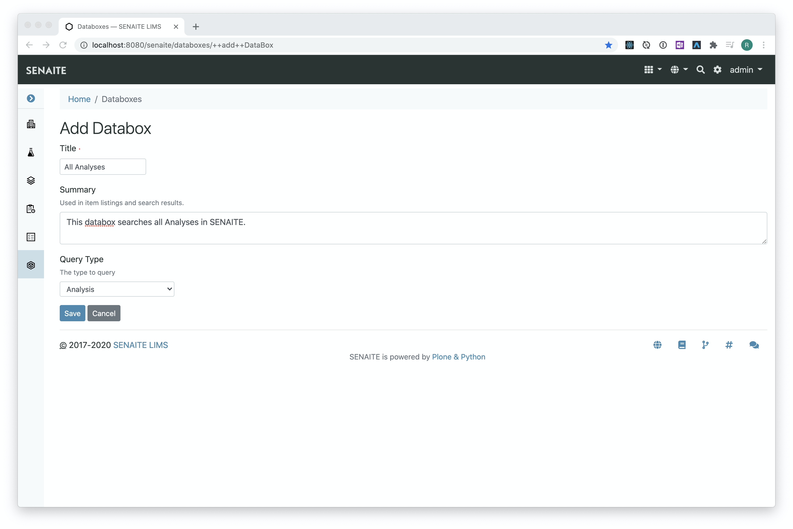
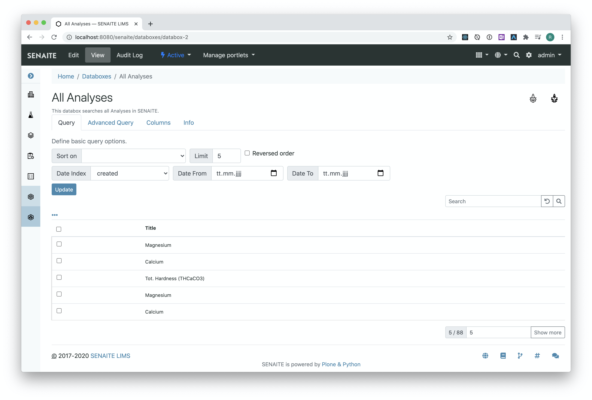
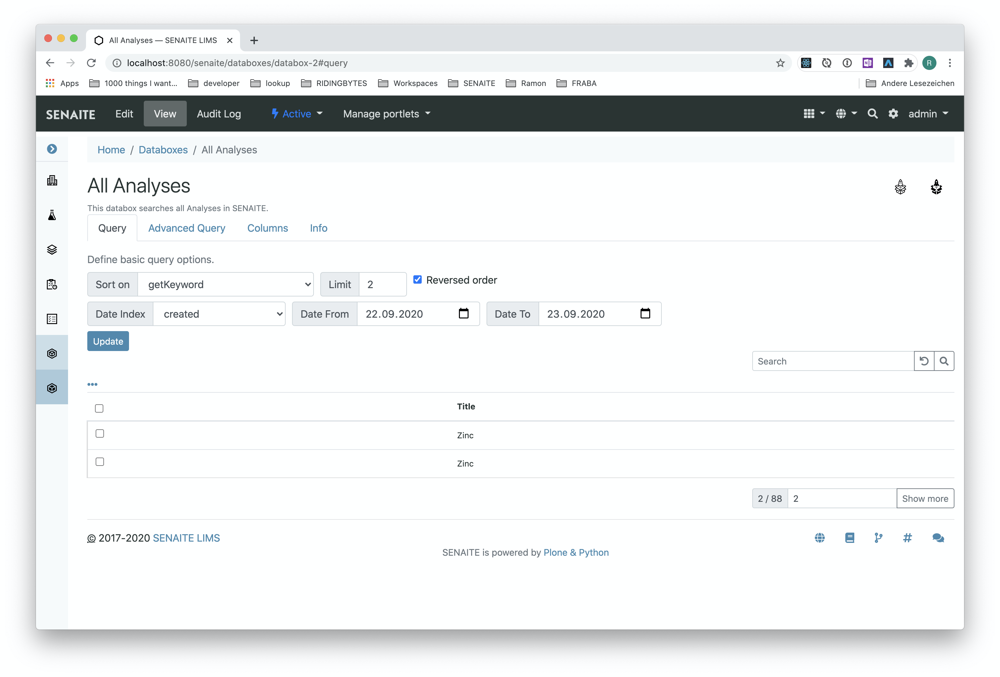
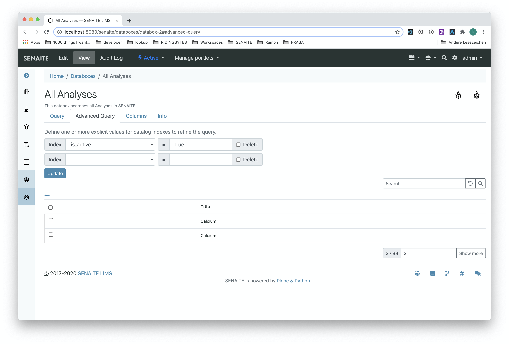
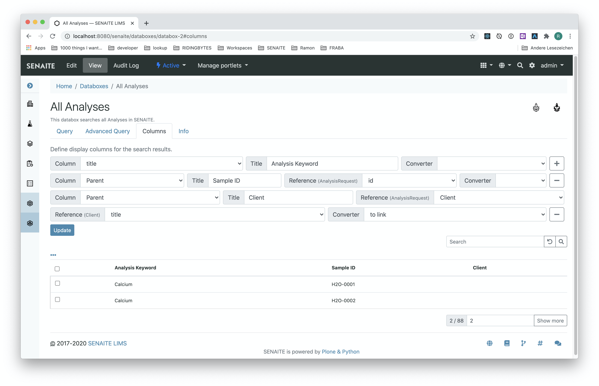
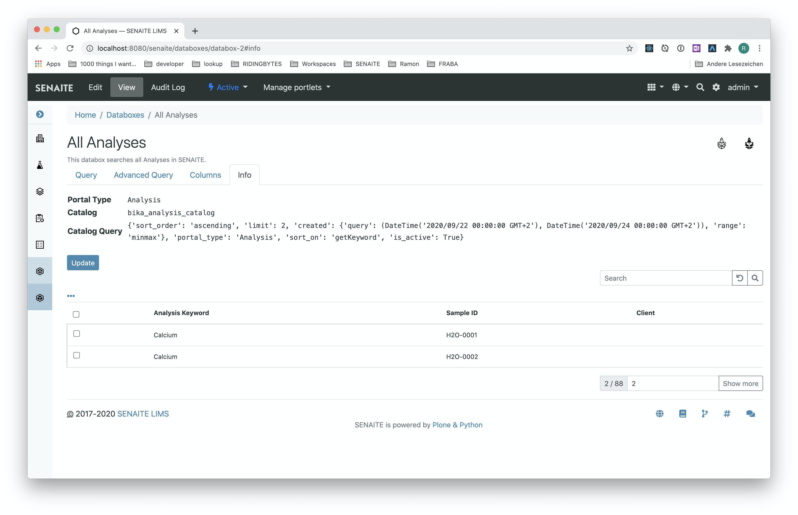
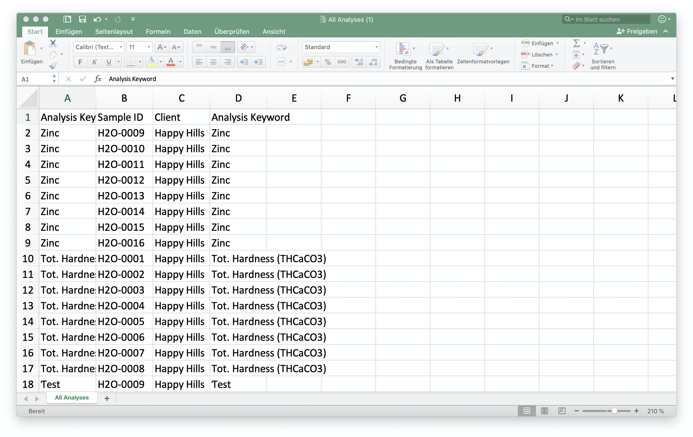

  

  
An intelligent folder for SENAITE

  
  

    
    
    
    
    
  

## About

SENAITE.DATABOX behaves like an intelligent folder with a stored database query.
When viewing the contents of a databox, the database query is executed and the
results are shown in a table listing with the configured columns.

Each databox can be directly exported as CSV or Excel.

## Quickstart

A databox can search at most one content type, e.g. `Sample`, `Analysis`, `Client` etc.
This content type must be defined on creation.

After the databox is created, all objects of the selected content type are
listed and the database query can be directly refined with the controls on top
of the table.

## Query Configuration

The query configuration in the controls allow to set the order, sort and the
pagesize of the listed items.

The results can be further narrowed down to a specific date region by choosing a
"from" and "to" date on one of the displayed date indexes.

## Advanced Query

The advanced query tab allows to filter the results by a certain catalog index.

**☝️Note:**

Catalog indexes can be added through the web in SENAITE, see
https://zope.readthedocs.io/en/latest/zopebook/SearchingZCatalog.html#defining-indexes

## Columns

The columns define the display fields of the results table (similar to a SELECT
in SQL). If a field references another content type, e.g. a `Sample` has a
reference to a `Client`, then it is possible to traverse these references to
integrate the fields of the target object.

**☝️Note:**

Some types provide a "virtual" `Parent` field to traverse to the parent object
that holds the current object. For example an `Analysis` is contained in a
`Sample` (`Analysis Request`). Therefore, the `Parent` field reveals the
`Sample` where the current `Analysis` is in.

## Info

The info tab shows the generated database query and is mosly for debugging
purpose.

## Exporting

Each databox allows through the two icons in the upper right cornder to export
the results with the configured columns and order to Excel or CSV.

